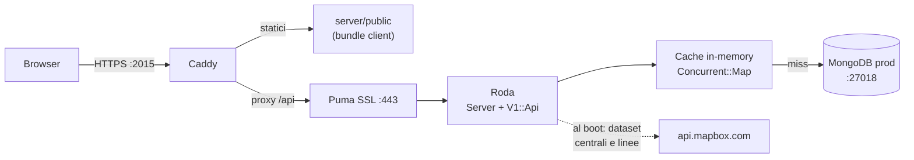
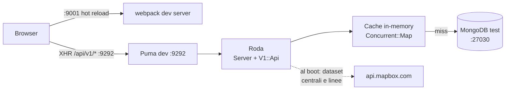
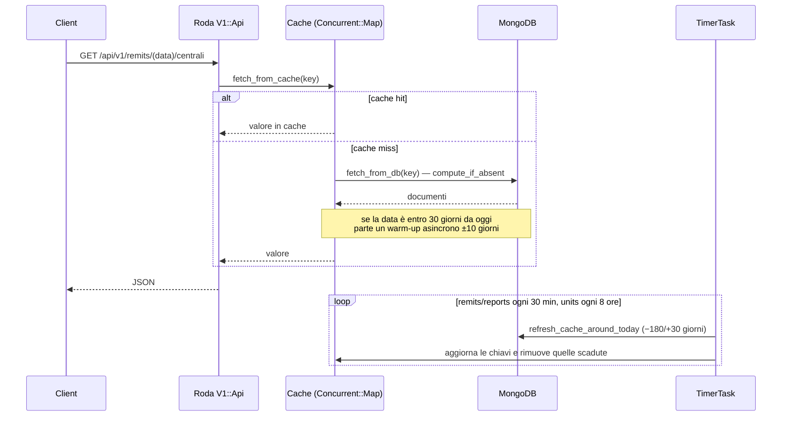
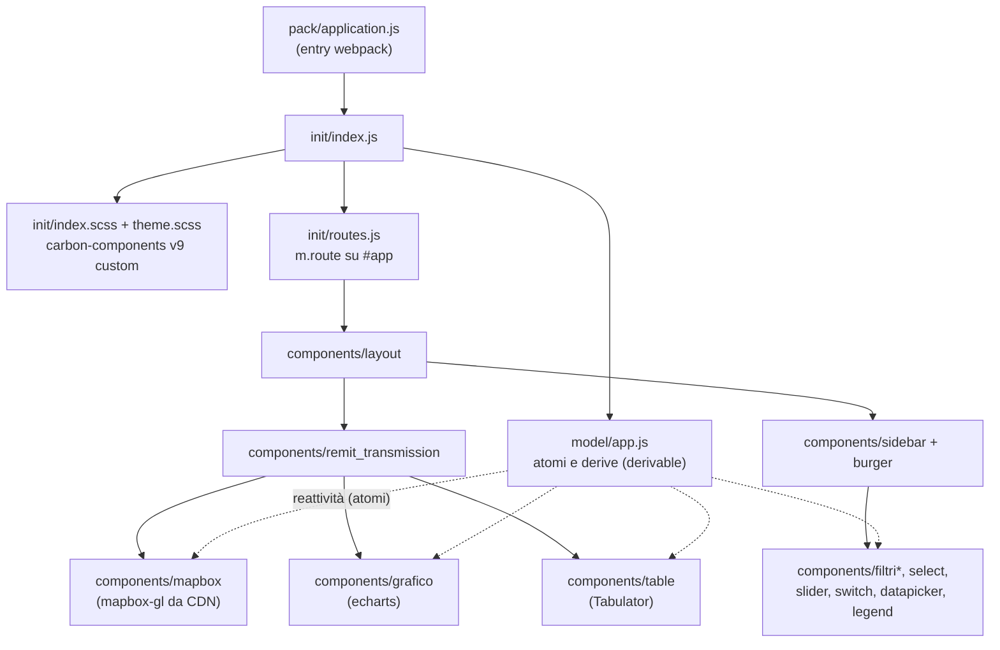

# Remit Mappa

**Versione corrente: 1.9.2** (vedi [VERSION](VERSION) e [CHANGELOG.md](CHANGELOG.md))

Web app interna che mostra su una **mappa interattiva dell'Italia** le indisponibilità
programmate **REMIT** delle centrali elettriche e delle linee di trasmissione a 380 e
220 kV. I dati geografici (centrali, linee) arrivano da dataset **Mapbox**; i dati
REMIT da un **MongoDB** popolato da progetti esterni e letto in sola lettura.

Backend Ruby (**Roda + Puma**) in `server/`, frontend JavaScript (**Mithril +
mapbox-gl + echarts + Tabulator**) in `client/`. Tutti i task di progetto sono
gestiti da **mise**.

## Indice

- [Stack tecnologico](#stack-tecnologico)
- [Architettura](#architettura)
  - [Produzione](#produzione)
  - [Sviluppo](#sviluppo)
  - [Ciclo di una richiesta API e cache](#ciclo-di-una-richiesta-api-e-cache)
  - [Struttura del client](#struttura-del-client)
- [Struttura del progetto](#struttura-del-progetto)
- [Prerequisiti](#prerequisiti)
- [Variabili d'ambiente](#variabili-dambiente)
- [Avvio in sviluppo](#avvio-in-sviluppo)
- [Avvio in produzione](#avvio-in-produzione)
- [Task di riferimento](#task-di-riferimento)
- [Test e lint](#test-e-lint)
- [Note operative e troubleshooting](#note-operative-e-troubleshooting)

## Stack tecnologico

### Backend (`server/`)

| Componente          | Versione  | Note                                                                                                                      |
| ------------------- | --------- | ------------------------------------------------------------------------------------------------------------------------- |
| Ruby                | 4.0.1     | gestito da mise (`mise.toml`)                                                                                             |
| Roda                | ~> 3.105  | routing tree, plugin `public`, `early_hints`, `multi_route`                                                               |
| Puma                | ~> 8.0.2  | dev su :9292, produzione SSL su :443                                                                                      |
| Rack                | ~> 3.2.6  | `Rack::Deflater` in produzione                                                                                            |
| mongo (driver)      | ~> 2.23.1 | **vincolata**: la 2.24 richiede MongoDB server >= 4.2 (wire version 8), il server in uso è MongoDB 4.0.x (wire version 7) |
| Oj                  | ~> 3.17   | serializzazione JSON                                                                                                      |
| concurrent-ruby-ext | ~> 1.3.7  | cache `Concurrent::Map`, job `Concurrent::TimerTask`                                                                      |
| settingslogic       | ~> 2.0.9  | config per ambiente da `config/config.yml` (con patch psych >= 4 in `app/initializers/settings.rb`)                       |
| childprocess        | ~> 5.1    | avvio di Caddy come child process in produzione                                                                           |
| parallel            | ~> 2.1    | warm-up della cache in parallelo                                                                                          |

### Frontend (`client/`)

| Componente                                                 | Versione     | Note                                                                                                                                                                                                                                                                                                            |
| ---------------------------------------------------------- | ------------ | --------------------------------------------------------------------------------------------------------------------------------------------------------------------------------------------------------------------------------------------------------------------------------------------------------------- |
| Mithril                                                    | ^2.3.8       | framework SPA, globale `m` via `webpack.ProvidePlugin`                                                                                                                                                                                                                                                          |
| mapbox-gl                                                  | 3.25.0       | **da CDN** in `src/index.html`, non è in `package.json`                                                                                                                                                                                                                                                         |
| echarts                                                    | ^6.1.0       | import modulari via shim `src/init/echarts.js`                                                                                                                                                                                                                                                                  |
| tabulator-tables                                           | ^6.5.2       | tabelle                                                                                                                                                                                                                                                                                                         |
| derivable                                                  | 2.0.0-beta.3 | state management reattivo (atomi/derive); progetto non più attivo, ultima versione esistente                                                                                                                                                                                                                    |
| carbon-components                                          | 9.91.5       | **vincolata alla v9**: copia SCSS personalizzata in `client/node_modules_custom/carbon-components`; v10/v11 richiedono il porting delle personalizzazioni (la v11 rinomina le classi `bx--` → `cds--`), lasciato alla versione v9 di proposito per avere bundle minimale solo con componenti usati nel progetto |
| dayjs, nouislider, mobius1-selectr, flatpickr, mainloop.js | —            | utilità (date, slider, select, loop di rendering)                                                                                                                                                                                                                                                               |
| webpack                                                    | ^5           | dev server ^6 su :9001 con hot reload                                                                                                                                                                                                                                                                           |

### Infrastruttura

| Componente | Versione | Note                                                                                          |
| ---------- | -------- | --------------------------------------------------------------------------------------------- |
| mise       | —        | runtime (ruby/node/python) e task di progetto                                                 |
| MongoDB    | 4.0.x    | dev :27030 (snapshot locale, senza journal), prod :27018; sola lettura (write concern `w: 0`) |
| Caddy      | v1       | reverse proxy HTTPS :2015 in produzione, avviato da Puma                                      |
| Windows    | 10/11    | i task mise girano in bash (MSYS2/Git Bash)                                                   |

## Architettura

### Produzione

In produzione Caddy è il punto d'ingresso su HTTPS :2015: serve i file statici da
`server/public` e fa da proxy di `/api` verso Puma, che gira in SSL su :443 sullo
stesso host. Al boot il server scarica i dataset geografici da Mapbox e i job
riempiono la cache in-memory; MongoDB è interrogato solo sui miss (dati non presenti in cache).



### Sviluppo

In sviluppo il client è servito dal webpack dev server su :9001 con hot reload e
chiama direttamente l'API Puma su :9292 (CORS aperto lato server). Il database è
uno snapshot locale su :27030, mai quello di produzione.



### Ciclo di una richiesta API e cache

Le API (`/api/v1/remits`, `/api/v1/reports`, `/api/v1/units`) leggono da una cache
in-memory (`Concurrent::Map`). Il miss è atomico (`compute_if_absent`: un solo fetch
per chiave anche sotto richieste concorrenti) e, se la data richiesta è entro 30
giorni da oggi, arma un warm-up dei ±10 giorni attorno. In parallelo, job
`Concurrent::TimerTask` rinfrescano periodicamente la cache: remits e reports ogni
30 minuti (finestra −180/+30 giorni attorno a oggi), units ogni 8 ore.



### Struttura del client

Il client è una SPA Mithril con un'unica route: l'entry `pack/application.js`
importa `init/index.js`, che carica gli stili, il modello e le route. Lo stato è
centralizzato in `model/app.js` come atomi e derivazioni **derivable**: i componenti
(mappa, grafico, tabelle, filtri) reagiscono agli stessi atomi senza passarsi dati
a mano.



## Struttura del progetto

```text
Remit_Mappa/
├── mise.toml                  # runtime (ruby/node/python), [env] MongoDB, task di progetto
├── VERSION                    # versione corrente
├── CHANGELOG.md
├── Procfile                   # avvio alternativo (foreman/overmind)
├── server/
│   ├── server.rb              # app Roda principale (development/production)
│   ├── Gemfile
│   ├── app/
│   │   ├── boot.rb            # require di patch, initializers, helpers, models, services
│   │   ├── boot_jobs.rb       # Scheduler: avvia i job di cache 2s dopo il boot
│   │   ├── initializers/      # settings.rb, mongodb.rb (pool, w:0), mapbox.rb (dataset)
│   │   ├── jobs/              # UpdateCacheRemit/Report (30 min), UpdateCacheUnits (8 ore)
│   │   ├── models/            # Remit, Report, Units (cache Concurrent::Map + query Mongo)
│   │   ├── routes/            # v1_api.rb + v1/ (remits.rb, reports.rb, units.rb)
│   │   ├── helpers/           # request_helper.rb (validazione date, json)
│   │   ├── services/          # logging.rb
│   │   └── patch/             # cattr.rb, arrotonda.rb
│   ├── config/
│   │   ├── config.yml         # DB per ambiente + MAPBOX_API_TOKEN (da env)
│   │   ├── puma_prod.rb       # Puma SSL :443 + avvio Caddy come child process
│   │   ├── mongod_dev.yaml    # mongod test :27030, senza journal
│   │   ├── mongod_prod.yaml   # mongod prod :27018, journal attivo
│   │   ├── CaddyfileProd_*    # un Caddyfile per host di produzione
│   │   ├── <host>.key/.crt    # certificati per host (non tracciati, gen_cert.sh)
│   │   └── gen_cert.sh
│   ├── public/                # bundle del client copiato da `mise run bundle-prod`
│   ├── log/                   # mongod_dev.log, mongod_prod.log, puma_*.log, caddy.log
│   └── spec/                  # suite RSpec (rack-test, simplecov)
├── client/
│   ├── package.json
│   ├── webpack.common.js      # entry, alias, ProvidePlugin (m, atom, derive, echarts…)
│   ├── webpack.dev.js         # dev server :9001 (o :9000 con ssl=true)
│   ├── webpack.prod.js        # minificazione, vendor split, gzip
│   ├── node_modules_custom/
│   │   └── carbon-components/ # copia SCSS personalizzata della v9
│   └── src/
│       ├── pack/application.js  # entry
│       ├── init/                # index.js, routes.js, echarts.js (shim), scss
│       ├── model/app.js         # stato applicativo: atomi e derive (derivable)
│       ├── components/          # mapbox, grafico, table, filtri*, sidebar, layout…
│       ├── icons/  images/
│       ├── index.html           # template dev (mapbox-gl 3.25 da CDN)
│       └── index_prod.html      # template produzione
├── script/
│   ├── avvia_server.sh        # avvio DETACHED di Puma dev|prod, log su file
│   ├── ferma_server.sh        # stop di Puma (dev/prod) e Caddy
│   └── copia_public.rb        # copia client/dist → server/public (usato da bundle-prod)
└── caddy/                     # materiale Caddy legacy, non tracciato (.gitignore)
```

## Prerequisiti

- **Windows** con una **bash** disponibile (MSYS2 o Git Bash): i task mise girano
  in bash (`[settings]` in `mise.toml`) e gli script in `script/` sono bash.

- **[mise](https://mise.jdx.dev/)**: gestisce i runtime del progetto
  (ruby 4.0.1, node lts, python 3.13). Al primo uso:

  ```bash
  mise trust
  mise install
  ```

- **MongoDB 4.0.x** installato (default `C:/Appl/Mongodb/bin`, override via
  variabili d'ambiente) con uno snapshot locale dei dati per lo sviluppo.

- **Caddy v1** (default `C:\APPL\caddy\caddy.exe`) — serve solo per lo stack di
  produzione.

- Un **token Mapbox** valido (vedi la variabile `MAPBOX_API_TOKEN` qui sotto).

Dipendenze dei due sottoprogetti (prima volta e dopo gli aggiornamenti):

```bash
cd server && bundle install
```

```bash
cd client && npm install
```

## Variabili d'ambiente

| Variabile                         | Obbligatoria | Default                           | Dove si usa                                                                                                                        |
| --------------------------------- | ------------ | --------------------------------- | ---------------------------------------------------------------------------------------------------------------------------------- |
| `MAPBOX_API_TOKEN`                | **Sì**       | —                                 | `server/config/config.yml`: senza, il boot del server fallisce con errore esplicito. Impostarla con `setx` e **riaprire la shell** |
| `MONGOD_EXE`                      | No           | `C:/Appl/Mongodb/bin/mongod.exe`  | task `db-test` / `db-prod` (`mise.toml [env]`)                                                                                     |
| `MONGO_EXE`                       | No           | `C:/Appl/Mongodb/bin/mongo.exe`   | task `db-test-stop` / `db-prod-stop`                                                                                               |
| `MONGODB_AMPERE_PATH`             | No           | `E:/Sviluppo/Ampere/DB/mongodata` | dbpath del mongod di produzione (task `db-prod`)                                                                                   |
| `MONGODB_AMPERE_DEVELOPMENT_PATH` | No           | `E:/Sviluppo/Ampere/DB_test/data` | dbpath del mongod di test (task `db-test`)                                                                                         |
| `CADDY_EXE`                       | No           | `C:\APPL\caddy\caddy.exe`         | `server/config/puma_prod.rb` (avvio di Caddy)                                                                                      |
| `RACK_ENV`                        | No           | `development`                     | ambiente dell'app (sezione di `config.yml`); `production` per lo stack prod; override supportato anche dal task `console`          |
| `RUN_COVERAGE_REPORT`             | No           | —                                 | `RUN_COVERAGE_REPORT=1` attiva il report coverage RSpec (soglia minima 88%)                                                        |
| `ssl`                             | No           | —                                 | `ssl=true` è usata dallo script npm `start_ssl` del client (dev server HTTPS su :9000)                                             |

Il token Mapbox si imposta una volta sola (mai committarlo):

```bash
setx MAPBOX_API_TOKEN "<token pk.>"
```

I default dei path MongoDB sono quelli di questo host: si sovrascrivono **senza
toccare `mise.toml`** con una variabile d'ambiente oppure con un `mise.local.toml`
personale (ha la precedenza).

## Avvio in sviluppo

Tre processi, ognuno nella propria shell. I task girano in **foreground** in bash:
il **Ctrl-C** ferma il processo e restituisce il prompt pulito (vedi `[settings]`
in `mise.toml`.

1. **Database di test** (snapshot locale su :27030, log su `server/log/mongod_dev.log`):

   ```bash
   mise run db-test
   ```

2. **API server** (Puma su :9292, log a video):

   ```bash
   mise run server-dev
   ```

3. **Client** (webpack dev server su :9001 con hot reload):

   ```bash
   mise run client-dev
   ```

L'app è su <http://localhost:9001> (l'API risponde su <http://localhost:9292>).

Per l'avvio **detached** di Puma (log su file, prompt libero) c'è lo script:

```bash
bash script/avvia_server.sh dev
```

e i task di stop si lanciano da un'altra shell: `mise run server-stop` (Puma e
Caddy), `mise run db-test-stop` (arresto pulito del mongod di test).

Comandi diretti equivalenti, per chi non usa mise:

```bash
cd server && bundle exec puma --port 9292
```

```bash
cd client && npm run start
```

```bash
mongod --config server/config/mongod_dev.yaml --dbpath "E:/Sviluppo/Ampere/DB_test/data"
```

## Avvio in produzione

1. **Build del client** e copia in `server/public` (webpack prod + `script/copia_public.rb`):

   ```bash
   mise run bundle-prod
   ```

2. **MongoDB di produzione** su :27018 (journal attivo, log su `server/log/mongod_prod.log`):

   ```bash
   mise run db-prod
   ```

3. **Stack di produzione** — Puma SSL su :443 più Caddy avviato da Puma come child
   process (config `server/config/puma_prod.rb`, log di Caddy su `server/log/caddy.log`):

   ```bash
   mise run server-prod
   ```

L'app è esposta da Caddy su `https://<hostname>:2015`; Caddy serve i file statici
da `server/public` e fa da proxy di `/api` verso Puma :443.

La configurazione è **host-aware**: `puma_prod.rb` legge l'hostname della macchina
e da quello sceglie i certificati `server/config/<host>.key` / `<host>.crt` e il
Caddyfile `server/config/CaddyfileProd_<host>`. Per aggiungere un nuovo host di
produzione basta generare certificato e Caddyfile con quel nome (vedi
`server/config/gen_cert.sh`).

Anche in produzione esiste l'avvio detached con log su file:

```bash
bash script/avvia_server.sh prod
```

## Task di riferimento

Elenco completo (`mise tasks`); si lanciano con `mise run <task>` dalla root.

| Task                         | Porta        | Log                                       | Scopo                                                                      |
| ---------------------------- | ------------ | ----------------------------------------- | -------------------------------------------------------------------------- |
| `server-dev`                 | :9292        | a video                                   | API server di sviluppo (foreground)                                        |
| `server-prod`                | :443 / :2015 | a video (Caddy su `server/log/caddy.log`) | stack di produzione: Puma SSL + Caddy                                      |
| `server-stop`                | —            | —                                         | ferma Puma (dev/prod) e Caddy (`script/ferma_server.sh`)                   |
| `client-dev`                 | :9001        | a video                                   | webpack dev server con hot reload                                          |
| `db-test`                    | :27030       | `server/log/mongod_dev.log`               | MongoDB di test (snapshot locale, senza journal)                           |
| `db-test-stop`               | —            | —                                         | arresto **pulito** del MongoDB di test (`db.shutdownServer()`)             |
| `db-prod`                    | :27018       | `server/log/mongod_prod.log`              | MongoDB di produzione (journal attivo)                                     |
| `db-prod-stop`               | —            | —                                         | arresto pulito del MongoDB di produzione                                   |
| `bundle-prod`                | —            | —                                         | build di produzione del client + copia in `server/public`                  |
| `console` (alias `c`, `pry`) | —            | —                                         | REPL Pry con l'app caricata (modelli, config, DB); ambiente via `RACK_ENV` |
| `test`                       | —            | —                                         | suite RSpec del server (richiede il mongod di test attivo su :27030)       |
| `coverage`                   | —            | `server/coverage/`                        | suite RSpec con report coverage, soglia minima 88%                         |
| `lint`                       | —            | —                                         | lint completo (dipende da `lint-server` + `lint-client`)                   |
| `lint-server`                | —            | —                                         | RuboCop sul server                                                         |
| `lint-client`                | —            | —                                         | ESLint su `client/src`                                                     |

## Test e lint

La suite RSpec richiede il **mongod di test attivo** su :27030 (`mise run db-test`
in un'altra shell):

```bash
mise run test
```

```bash
mise run coverage
```

Il report coverage finisce in `server/coverage/`; la build fallisce sotto la
soglia minima dell'88%.

```bash
mise run lint
```

Console di sviluppo con l'app caricata (connessione al DB compresa):

```bash
mise run console
```

Per la console sull'ambiente di produzione: `RACK_ENV=production mise run console`.

## Note operative e troubleshooting

- **Il DB di test è senza journal** (`mongod_dev.yaml`): mai kill brusco del
  processo, solo arresto pulito con `mise run db-test-stop` (che esegue
  `db.shutdownServer()`). Vale anche per quello di produzione: `mise run db-prod-stop`.
- **Il DB si usa in sola lettura**: il client Mongo è configurato con write
  concern `w: 0, j: false` (`server/app/initializers/mongodb.rb`). I dati sono
  popolati da progetti esterni; l'app li rilegge da sola grazie alla scadenza
  della cache.
- **Boot lento è normale**: dopo l'avvio il server scarica i dataset Mapbox e i
  job riempiono la cache (~30 secondi prima che l'app sia reattiva; il progresso
  è nei log).

Errori tipici al boot del server:

| Errore                                                                                                                 | Significato / rimedio                                                                                                                        |
| ---------------------------------------------------------------------------------------------------------------------- | -------------------------------------------------------------------------------------------------------------------------------------------- |
| `Variabile MAPBOX_API_TOKEN mancante: impostarla con setx ...`                                                         | il token non è nell'ambiente: `setx MAPBOX_API_TOKEN "<token pk.>"` e **riaprire la shell**                                                  |
| `Non riesco connetermi al db: 1) Controllare che il server mongodb sia avviato...` (`Mongo::Error::NoServerAvailable`) | il mongod dell'ambiente non è raggiungibile: avviarlo (`mise run db-test` in dev) e verificare indirizzo/porta in `server/config/config.yml` |
| `I dataset Mapbox non hanno il formato atteso (manca "features")`                                                      | il token è presente ma non valido, o i dataset non esistono più sull'account Mapbox                                                          |
| `Non riesco a scaricare i dataset Mapbox da api.mapbox.com`                                                            | problema di rete/proxy verso `api.mapbox.com`                                                                                                |
| `mise ERROR Config files ... are not trusted`                                                                          | prima esecuzione su una macchina nuova: `mise trust` nella root del progetto                                                                 |
| `C'è già un server in ascolto sulla porta ...` (da `avvia_server.sh`)                                                  | un Puma è già attivo: `mise run server-stop` e riprovare                                                                                     |
